# AASO Pharma Database Schema

## Visual Database Diagram

```mermaid
erDiagram
    ORGANIZATIONS ||--o{ CUSTOMERS : has
    ORGANIZATIONS ||--o{ PRODUCTS : has
    ORGANIZATIONS ||--o{ ORDERS : has
    ORGANIZATIONS ||--o{ INVOICES : has
    
    CUSTOMERS ||--o{ ORDERS : places
    CUSTOMERS ||--o{ INVOICES : receives
    
    PRODUCTS ||--o{ BATCHES : has
    PRODUCTS ||--o{ ORDER_ITEMS : includes
    PRODUCTS ||--o{ INVOICE_ITEMS : includes
    
    BATCHES ||--o{ ORDER_ITEMS : selected_from
    BATCHES ||--o{ INVENTORY_MOVEMENTS : tracks
    
    ORDERS ||--o{ ORDER_ITEMS : contains
    ORDERS ||--|| INVOICES : generates
    
    INVOICES ||--o{ INVOICE_ITEMS : contains
    INVOICES ||--o{ INVOICE_PAYMENTS : receives
    
    ORGANIZATIONS {
        uuid org_id PK
        string org_name
        string gstin
        string address
        string city
        string state
        string pincode
        string phone
        string email
        timestamp created_at
        timestamp updated_at
    }
    
    CUSTOMERS {
        serial customer_id PK
        uuid org_id FK
        string customer_code UK
        string customer_name
        string contact_person
        string phone
        string email
        string address_line1
        string city
        string state
        string pincode
        string gstin
        string customer_type
        decimal credit_limit
        int credit_days
        decimal discount_percent
        boolean is_active
        timestamp created_at
        timestamp updated_at
    }
    
    PRODUCTS {
        serial product_id PK
        uuid org_id FK
        string product_code UK
        string product_name
        string category
        string manufacturer
        string composition
        string strength
        string unit_of_measure
        string hsn_code
        decimal gst_percent
        string drug_schedule
        boolean requires_prescription
        boolean is_active
        timestamp created_at
        timestamp updated_at
    }
    
    BATCHES {
        serial batch_id PK
        int product_id FK
        uuid org_id FK
        string batch_number
        date manufacturing_date
        date expiry_date
        decimal mrp
        decimal purchase_price
        decimal selling_price
        int quantity_received
        int quantity_available
        int quantity_sold
        string supplier_name
        timestamp created_at
        timestamp updated_at
    }
    
    ORDERS {
        serial order_id PK
        uuid org_id FK
        string order_number UK
        int customer_id FK
        date order_date
        date delivery_date
        string order_status
        string order_type
        string payment_terms
        decimal subtotal_amount
        decimal discount_amount
        decimal tax_amount
        decimal final_amount
        decimal paid_amount
        timestamp created_at
        timestamp updated_at
        timestamp confirmed_at
        timestamp delivered_at
    }
    
    ORDER_ITEMS {
        serial order_item_id PK
        int order_id FK
        int product_id FK
        int batch_id FK
        string product_name
        string batch_number
        date expiry_date
        int quantity
        decimal mrp
        decimal selling_price
        decimal discount_percent
        decimal discount_amount
        decimal tax_percent
        decimal tax_amount
        decimal total_price
    }
    
    INVOICES {
        serial invoice_id PK
        uuid org_id FK
        int order_id FK
        int customer_id FK
        string invoice_number UK
        date invoice_date
        date due_date
        string invoice_status
        decimal subtotal_amount
        decimal discount_amount
        decimal taxable_amount
        decimal cgst_amount
        decimal sgst_amount
        decimal igst_amount
        decimal total_tax_amount
        decimal total_amount
        decimal paid_amount
        string gst_type
        int payment_terms_days
        string notes
        timestamp created_at
        timestamp updated_at
    }
    
    INVOICE_ITEMS {
        serial invoice_item_id PK
        int invoice_id FK
        string product_name
        string hsn_code
        string batch_number
        int quantity
        string unit_of_measure
        decimal unit_price
        decimal discount_amount
        decimal taxable_amount
        decimal gst_percent
        decimal cgst_amount
        decimal sgst_amount
        decimal igst_amount
        decimal line_total
    }
    
    INVOICE_PAYMENTS {
        serial payment_id PK
        int invoice_id FK
        date payment_date
        decimal amount
        string payment_mode
        string reference_number
        string bank_name
        string notes
        timestamp created_at
    }
    
    INVENTORY_MOVEMENTS {
        serial movement_id PK
        int batch_id FK
        string movement_type
        int quantity_in
        int quantity_out
        string reference_type
        int reference_id
        string reason
        timestamp movement_date
        timestamp created_at
    }
```



## Table Details

### 1. Core Tables

#### organizations
- **Purpose**: Multi-tenant support for different pharmacy businesses
- **Key Fields**: org_id (UUID), gstin, business details
- **Relationships**: Parent to all business entities

#### customers
- **Purpose**: Store customer/client information
- **Key Fields**: customer_code (unique), gstin, credit limits
- **Special**: Supports both B2B (with GSTIN) and B2C customers

#### products
- **Purpose**: Master product catalog
- **Key Fields**: product_code (unique), hsn_code, gst_percent
- **Special**: Includes drug schedule for regulatory compliance

### 2. Inventory Tables

#### batches
- **Purpose**: Track product batches with expiry
- **Key Fields**: batch_number, expiry_date, quantities
- **Special**: Maintains available quantity for real-time stock

#### inventory_movements
- **Purpose**: Audit trail for all stock changes
- **Types**: purchase, sale, adjustment, return, expiry
- **Special**: Links to source transaction for traceability

### 3. Transaction Tables

#### orders
- **Purpose**: Sales/purchase orders
- **Status Flow**: draft → confirmed → delivered → completed
- **Key Fields**: order_number (unique), final_amount, payment status

#### order_items
- **Purpose**: Line items in orders
- **Special**: Captures price at time of order, links to specific batch

### 4. Billing Tables

#### invoices
- **Purpose**: GST-compliant tax invoices
- **Key Fields**: invoice_number (unique per FY), GST breakup
- **Special**: Tracks payment status, supports partial payments

#### invoice_items
- **Purpose**: Invoice line items with GST details
- **Special**: Stores CGST/SGST/IGST based on transaction type

#### invoice_payments
- **Purpose**: Payment records against invoices
- **Special**: Supports multiple payments per invoice

## Key Design Principles

### 1. Data Integrity
- Foreign key constraints ensure referential integrity
- Check constraints validate business rules
- Unique constraints prevent duplicates

### 2. Audit Trail
- All tables have created_at, updated_at timestamps
- Inventory movements track every stock change
- Order status transitions are logged

### 3. Multi-tenancy
- org_id in all business tables
- Row-level security in database
- Tenant isolation at API level

### 4. GST Compliance
- Separate CGST/SGST for intra-state
- IGST for inter-state transactions
- HSN codes for all products
- GSTIN validation for B2B

### 5. Performance
- Indexes on frequently queried columns
- Denormalized certain fields for speed
- Batch processing for bulk operations

## Common Queries

### 1. Current Stock
```sql
SELECT p.product_name, b.batch_number, b.expiry_date, 
       b.quantity_available, b.mrp
FROM products p
JOIN batches b ON p.product_id = b.product_id
WHERE b.quantity_available > 0
  AND b.expiry_date > CURRENT_DATE
ORDER BY p.product_name, b.expiry_date;
```

### 2. Customer Outstanding
```sql
SELECT c.customer_name, 
       SUM(i.total_amount - i.paid_amount) as outstanding
FROM customers c
JOIN invoices i ON c.customer_id = i.customer_id
WHERE i.invoice_status != 'cancelled'
  AND i.total_amount > i.paid_amount
GROUP BY c.customer_id, c.customer_name;
```

### 3. Daily Sales
```sql
SELECT DATE(o.order_date) as date,
       COUNT(DISTINCT o.order_id) as orders,
       SUM(o.final_amount) as total_sales
FROM orders o
WHERE o.order_status IN ('confirmed', 'delivered')
  AND o.order_date >= CURRENT_DATE - INTERVAL '30 days'
GROUP BY DATE(o.order_date)
ORDER BY date DESC;
```

### 4. Expiring Stock
```sql
SELECT p.product_name, b.batch_number, b.expiry_date,
       b.quantity_available, b.quantity_available * b.mrp as value
FROM products p
JOIN batches b ON p.product_id = b.product_id
WHERE b.quantity_available > 0
  AND b.expiry_date BETWEEN CURRENT_DATE AND CURRENT_DATE + INTERVAL '90 days'
ORDER BY b.expiry_date, value DESC;
```

## Migration Strategy

### Current State Issues
1. Column name mismatches (total_amount vs final_amount)
2. Missing billing tables in production
3. Inconsistent data types

### Migration Plan
1. Create migration scripts for each table
2. Add missing columns without breaking existing
3. Rename columns in phases with backward compatibility
4. Update application code to match
5. Remove deprecated columns after verification

## Future Enhancements

### Planned Tables
1. **purchase_orders**: Incoming inventory
2. **suppliers**: Vendor management
3. **users**: Authentication and authorization
4. **roles_permissions**: Access control
5. **audit_logs**: Complete audit trail
6. **notifications**: Alert management
7. **reports_config**: Custom report builder

### Planned Features
1. Barcode tracking for batches
2. Serial number tracking for devices
3. Temperature monitoring for cold chain
4. Document attachments for orders
5. Multi-currency support
6. Multi-location inventory